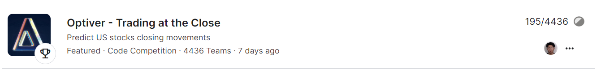

# Optiver_Full_code
> This Repo is used as supplementary material for Jiahe Wang's job application

**Update 3/29/2024** : I found my final ranking is 195/4436 Top5% and got a silver medal. I will add more details of the cross validation and feature selection results, I was too busy with my RA and Intern work but now I have time to give all the details of my code.

My code for Optiver's competition is the file ```LgbmTheBest.ipynb```. LightGBM is the best haha.

An overview:

This is my code that achieves 5.3343 on the public leaderboard in the competition [Optiver - Trading at the Close, Predict US stocks closing movements](https://www.kaggle.com/competitions/optiver-trading-at-the-close). The final result is 5.4718 or rank 195/4436 Top5% using three months market data after submission deadline.



Full code is a combination of community works and my own modification of the feature enigneering part.

Important references:

- [About some modeling ideas](https://www.kaggle.com/competitions/optiver-trading-at-the-close/discussion/450626) for modeling ideas.

- [Optiver | Cross Validation Strategies](https://www.kaggle.com/code/sunghoshim/optiver-cross-validation-strategies) for Purged K-Fold Validation, which came from the book *Advances in Financial Machine Learning*

The following part of the notebook is orginzed as : 1. feature enigineering. 2. Hyperparameters.

Within each part, i will explain how i managed to get the results.

---

## Feature enigineering

About feature enigneering, I will explain my features one by one, but before all of this, you can check my EDA notebook and data part of the competition to have a basic understanding of the dataset and its columns:

- [My notebook for EDA](https://www.kaggle.com/code/nolansmith/eda-part1-missing-values)

- [Data page of the competition](https://www.kaggle.com/competitions/optiver-trading-at-the-close/data)

Feature Enigineering Code:
```python
def imbalance_features(df):
    # Define lists of price and size-related column names
    prices = ["reference_price", "far_price", "near_price", "ask_price", "bid_price", "wap"]
    sizes = ["matched_size", "bid_size", "ask_size", "imbalance_size"]
    
    df["volume"] = df.eval("ask_size + bid_size")
    df["mid_price"] = df.eval("(ask_price + bid_price) / 2")
    df["liquidity_imbalance"] = df.eval("(bid_size-ask_size)/(bid_size+ask_size)")
    df["matched_imbalance"] = df.eval("(imbalance_size-matched_size)/(matched_size+imbalance_size)")
    df["size_imbalance"] = df.eval("bid_size / ask_size")

    for c in combinations(prices, 2):
        df[f"{c[0]}_{c[1]}_imb"] = df.eval(f"({c[0]} - {c[1]})/({c[0]} + {c[1]})")

    for c in [['ask_price', 'bid_price', 'wap', 'reference_price'], sizes]:
        triplet_feature = calculate_triplet_imbalance_numba(c, df)
        df[triplet_feature.columns] = triplet_feature.values
    
    # calculate the 60 seconds ago's target
    df["weighted_wap"] = df["stock_id"].map(weights) * df["wap"]
    df['market_index'] = df.groupby(['date_id', 'seconds_in_bucket'])['weighted_wap'].transform(lambda x : x.sum())
    del df['weighted_wap']
    df['lag_mi'] = df.groupby(['stock_id', 'date_id'])['market_index'].pct_change(periods=6) * 10000
    df['lag_wap'] = df.groupby(['stock_id', 'date_id'])['wap'].pct_change(periods=6) * 10000
    df['lag_target'] = (df.lag_wap - df.lag_mi)
    # some feature engineering with lag_target
    df['market_volatility_contribution'] = df.lag_wap / df.lag_mi
    df['Dlag_target'] = df.groupby(['stock_id', 'date_id'])['lag_target'].diff()
    df['Dlag_mi'] = df.groupby(['stock_id', 'date_id'])['lag_mi'].diff()
    
    #-----------------------------------------
    
    df['wap_momentum'] = df.groupby(['stock_id', 'date_id'])['wap'].pct_change(periods=6)
   
    df["imbalance_momentum"] = df.groupby(['stock_id', 'date_id'])['imbalance_size'].diff(periods=1) / df['matched_size']
    df["price_spread"] = df["ask_price"] - df["bid_price"]
    df["spread_intensity"] = df.groupby(['stock_id', 'date_id'])['price_spread'].diff()
    df['price_pressure'] = df['imbalance_size'] * (df['ask_price'] - df['bid_price'])
    df['market_urgency'] = df['price_spread'] * df['liquidity_imbalance']
    df['depth_pressure'] = (df['ask_size'] - df['bid_size']) * (df['far_price'] - df['near_price'])
    
    df['spread_depth_ratio'] = (df['ask_price'] - df['bid_price']) / (df['bid_size'] + df['ask_size'])
    df['mid_price_movement'] = df['mid_price'].diff(periods=5).apply(lambda x: 1 if x > 0 else (-1 if x < 0 else 0))
    
    df['micro_price'] = ((df['bid_price'] * df['ask_size']) + (df['ask_price'] * df['bid_size'])) / (df['bid_size'] + df['ask_size'])
    df['relative_spread'] = (df['ask_price'] - df['bid_price']) / df['wap']
```

---

- First are some basic terms in the trading : volume, mid_price, liquidity_imbalance, matched_imbalance and size_imbalance.

- Second are price combinations, these features came from community, I don't know if these features have any economics meaning, but they do help imporve the model.

- Then is the replication of the target. Optiver only said that they build a market index and use the following formula to calculate the target: $Target = (StockWAP_{t+60} / StockWAP_{t} - IndexWAP_{t+60} / IndexWAP_{t})*10000$     StockWAP is given as the wap column in the data, IndexWAP is unknown but since target is known in training set, we can calculate the market index. Then, to reproduce the market index in testing set, i first use a simple average of 200 stocks within each second to represent the index, they are actually pretty close. Then i thought, IndexWAP maybe just a linear combination of the stocks wap, so i run a linear regression and $R^2$ is 0.99. The weights of each stock is stored in the variable ```weights```, so the feature ```df['market_index']``` is just the market index mentioned in the building of target.

- After getting the market index, i want to build the target. Of course, I can't built now's target since it requires 60s later's market index and wap. But i can build 60s ago's target using current market index and wap. And this is the feature ```df['lag_target']```. I also build the feature ```df['market_volatility_contribution']``` to represent the market volatility contribution of each stock. It turns out that this feature works really good.

- The rest part of features are simply trading factors like price_spread, price_pressure, depth_pressure, etc.

---

## Hyperparameters and Cross validation Methods

GBM hyperparameters:

When talking about tuning hyperparameters, it is really important to use correct cross validation methods. In financial machine learning, history return is just one realization of a random process, it is not mean value so there are a lot of noises. Marcos López de Prado, the author of the book *Advances in Financial Machine learning*, proposed a cross validation method designed for financial time series called Purged cross validation. Details of this method can be found online or on his book, the key idea of this method is to prevent the data lekage caused by the auto-corrlation in the time serise and tries to give a general future error score of the model. It really imporves my model a lot. And the final hyperparameters are listed below, the ideas behind these values are that to prevent over-fitting, you need to learn slowly(low learning rate).

```python
lgb_params = {
    "objective": "mae",
    "n_estimators": 6000,
    "num_leaves": 256,
    "subsample": 0.6,
    'bagging_freq' : 250,
    "colsample_bytree": 0.8,
    "learning_rate": 0.01,
    'max_depth': 11,
    "n_jobs": 4,
    "device": "gpu",
    "verbosity": -1,
    "importance_type": "gain",
    "reg_alpha": 0.2,
    "reg_lambda": 2
}
```
